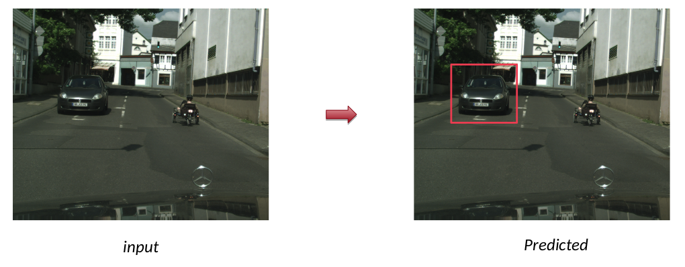
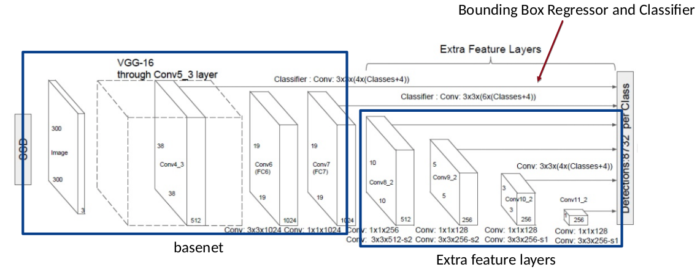
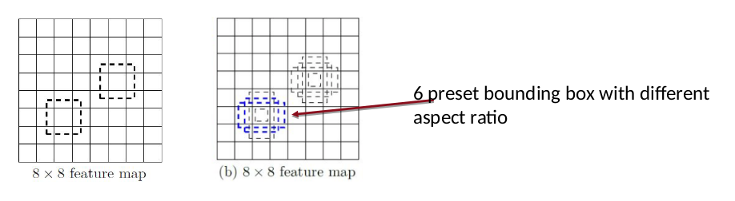
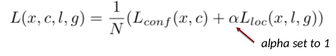

# SSD-Vehicle-Detector
Vehicle Detector Implementation using Single Shot Multibox Detector, using MobileNet(instead of VGG)

## Setup
```
python3.5
CUDA 8.0
pytorch
torchvision
matplotlib
numpy
PIL
opencv2
```

## Dataset
You can download the full cityscape datset from [here](https://www.cityscapes-dataset.com/) \
Also, you can have some sample dataset with labels in this repository
- 3475 annotated + 19998 extra annotated images
- Class Definitions: Vehicle, Humans, Object etc. -> the other objects except the selected (negative samples) are labeled to 0 
- Instance are segmented with polygons -> these are converted to boudning boxes 

## Task


## Network


- The original SSD used VGG16, but [MobileNetV2](https://arxiv.org/abs/1801.04381) are implemented for fast computation
- Extra feature extractor: Down-sampling the feature map with multiple levels
- Bounding box regressor: Predicting the offset for the prior bounding
- Bounding box classifier: Predicting the confidence score for each class

## Implementation
- Prior bounding boxes are created for each feature pixel 

- Loss Function: 

  - Hard Negative Mining: Balance the positive samples and negative samples. 
  - L_conf: Entropy loss of multi-label classification. Note the idx=0 is background
  - L_loc: regression loss of bounding box offset, the conversion
- For test: 
  1. Normalized the classification output with softmax
  2. Implemented NMS (Non-Maximum Suppression) for filtering out
unnecessary bounding boxes and compute the best overlap bounding
box for each object.

## Author

Suhong Kim – [@github](https://github.com/suhongkim) – suhongkim11@gmail.com \
Distributed under the MIT license. See the [LICENSE.md](LICENSE.md) file for details


## Inspiration
This project is a part of the CMPT743(Visual Computing Lab1) at SFU. 
Polease check the original SSD [paper](https://arxiv.org/abs/1512.02325) and [implementation](https://github.com/weiliu89/caffe.git) 
